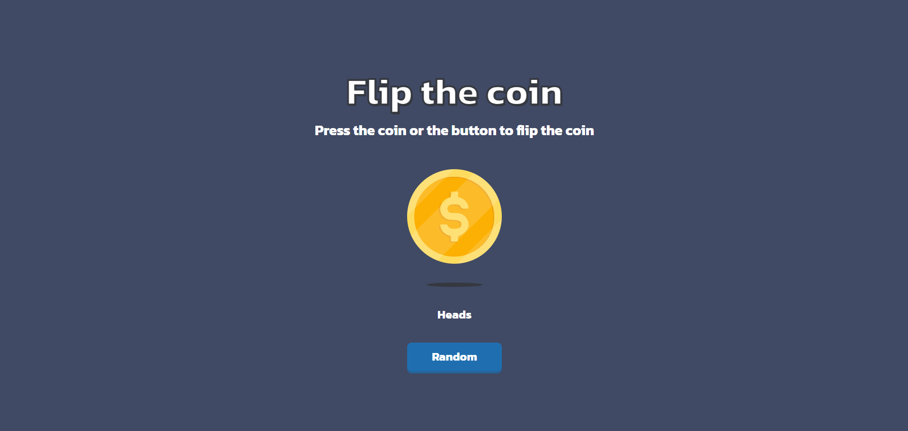

<p align="center">
  <a href="https://filp-a-coin.vercel.app/" target="_blank">
    
  </a>
</p>

<h1 align="center">Flip-the-Coin</h1>

<p align="center">
  <a href="https://filp-a-coin.vercel.app/" target="_blank">Live Demo</a> • 
  <a href="#project-description">Project Description</a> • 
  <a href="#features">Features</a> • 
  <a href="#tech-stack">Tech Stack</a> • 
  <a href="#installation">Installation</a> • 
  <a href="#usage">Usage</a> • 
  <a href="#license">License</a>
</p>



---

## Project Description

Flip-a-Coin is a **responsive and interactive coin-flipping web app** built with **Next.js** and **Tailwind CSS**.  
It simulates a coin toss with smooth animations, providing either **Heads** or **Tails** outcomes.  

🔗 [Live Demo](https://filp-a-coin.vercel.app/)

---

## Features

- Simulates coin flips with random outcomes (**Heads** or **Tails**)  
- Smooth coin flip animations  
- Responsive design for both mobile and desktop  

---

## Tech Stack

- **Framework**: Next.js, React  
- **Styling**: Tailwind CSS  
- **Deployment**: Vercel  

---

## Installation

```bash
git clone https://github.com/nca-gabriel/filp-a-coin.git
cd filp-a-coin
npm install
``` 
---

## Usage

Start the development server:

```bash
npm run dev
```

